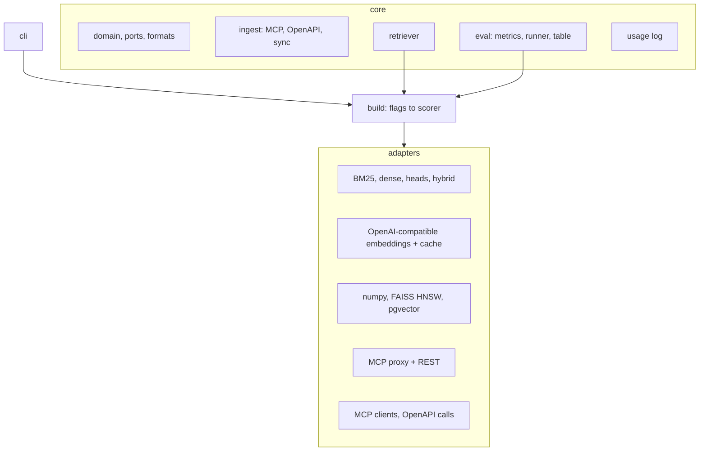
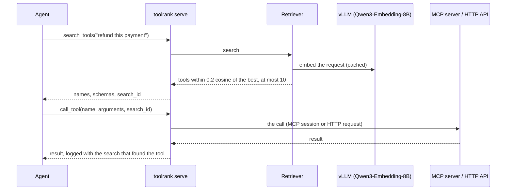
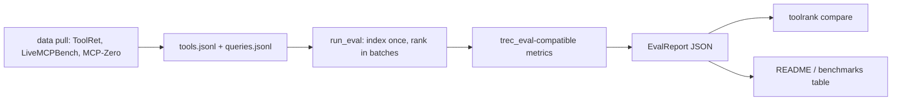

# Architecture

toolrank is organised as ports and adapters. The core (domain types, text formats, evaluation,
ingestion, the retriever and the usage log) never imports an adapter; `toolrank.build` is the one
place that turns command-line flags into a scorer, an encoder, heads and a vector index, and the
CLI, the evaluation and the server all go through it. Heavy dependencies (torch, the MCP SDK,
FAISS, Postgres, the vendors' SDKs) are optional extras, imported inside the functions that need
them: the base install is numpy and bm25s.

## Serving a request

- **Retriever.** It holds one immutable state: the tools, an id map and an indexed scorer. When
  `tools.jsonl` changes, it builds a new state and swaps it in whole, so searches run in threads
  without locks. The first index builds in the background with a BM25 stand-in answering
  meanwhile.
- **Scorers.** `DenseScorer` is an encoder, text formats and a vector index. `CLMScorer` is a dense
  scorer whose projections are the heads: the action head on tools, the state head on requests.
  `HybridScorer` fuses BM25 by reciprocal rank fusion (opt-in: it helps only requests written from
  tool descriptions). Adaptive K cuts every list at the margin from the best cosine.
- **Vector indexes.** Rows are keyed by a hash of the encoder settings, the heads file and the tool
  text, so a persistent index embeds and projects only new or changed tools. `NumpyIndex` is an
  exact scan (the default), `FaissIndex` HNSW, `PgVectorIndex` Postgres.
- **The server.** `toolrank serve` is the MCP SDK's low-level server with two tools, plus REST routes
  on the same Starlette app, behind one guard for tokens, the Host and Origin checks and a body
  limit. Calls go to long-lived MCP client sessions (opened lazily, reopened after a crash, an
  in-flight call never resent) or to OpenAPI operations over HTTP (GET and HEAD unless allowed,
  credentials only to their own base URL, no redirects).
- **Usage log.** Each search and call is appended to a daily JSONL file with a single write. Each
  call is linked to a search, first by `search_id`, then by the latest search of its session, then
  by the same client's latest (HTTP clients have no session id).
  Requests and arguments are stored as keyed digests.

## Evaluation

Every benchmark is converted once into the same JSONL pair, so evaluation never touches the
network. The metrics match `trec_eval` (NDCG, recall, precision, MAP) plus ToolRet's
Comprehensiveness. Reports record the settings that shape a number (text formats, instruction
setting, model, truncation, heads file), and the results table refuses a report that does not
follow the protocol.

## Heads

The heads are two MLPs with a skip connection, trained on cached backbone vectors: the backbone
stays frozen, so an epoch over 60,000 pairs takes about 18 seconds on one GPU. Checkpoints are torch
`.pt` files during training and numpy `.npz` files for serving; the `.npz` also carries its serving
settings, which `build` applies as defaults. Packaged heads are loaded without pickle and checked
against a sha256 when downloaded.

## Packages and images

- **The Python package** has one required dependency set (numpy, bm25s) and extras for everything
  else: `[mcp]` for serving and MCP ingestion, `[openapi]` for YAML specs, `[stem]`, `[faiss]`,
  `[pgvector]`, `[clm]` (torch, training only), `[data]` (benchmark downloads), and one per
  integration.
- **The `toolrank` image** is the package with `[mcp,openapi,stem]` at the versions locked in
  `uv.lock`, plus Node.js and uv for stdio MCP servers, and the packaged heads.
- **The `toolrank-vllm` image** (built locally, not published) adds the embedding backbone: it
  starts vLLM on loopback, waits for it, then runs toolrank.
